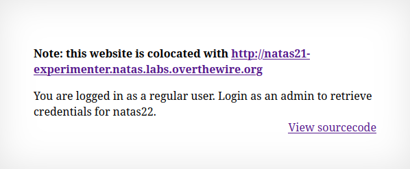
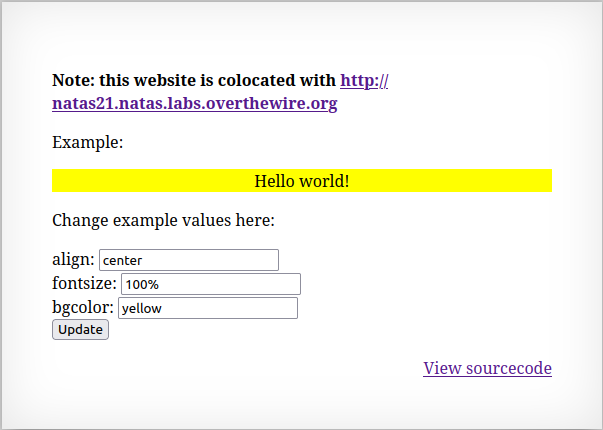

```
Username: natas21
Password: BPhv63cKE1lkQl04cE5CuFTzXe15NfiH
URL:      http://natas21.natas.labs.overthewire.org
```

- for this level, when opening the site, I see the following message: 

- the source code for this site just tells me i need to get a `$_SESSION` key/value pair of "admin=1" to get the password

- if i click the link, it sends me to:



- this site lets me change different CSS attributes

- the source code defines valid keys, which are the CSS attributes
- then the form reads these from the user and creates a form input, with either the default value, or the value taken out of the `$_SESSION` variable
- then the CSS values are concatenated into the $style variable ans added into a HTML div

- in the end, there is the logic that handles POST requests with data to update the variables

- here, there is no checking for valid keys, so i can append anything, and have it read into the `$_SESSION` variable
- also, the sites are co-located, so the session data for both websites is stored on the same server

- to get the password for the next level, i need to add the key/value pair admin=1 to the `$_SESSION` variable
- to do this, i can add this pair to the data sent when the user sends the CSS variables 
```
align=center&fontsize=100%25&bgcolor=yellow&submit=Update&admin=1
```
- then i need to quickly copy the PHPSESSID from the response and add it to the request made to the main page
- this will tell the server i am logged as an admin and will reveal the password for the next level
# Password

-  **d8rwGBl0Xslg3b76uh3fEbSlnOUBlozz**
